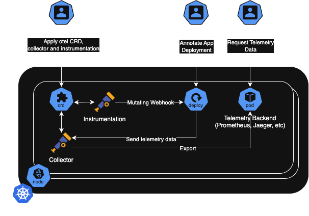

Adopting observability can be challenging for many engineering teams. In environments with dozens or even hundreds of microservices, convincing product and engineering teams to manually instrument their applications can be a slow and exhausting process. OpenTelemetry’s auto-instrumentation, also known as zero-code instrumentation, emerges as a solution to accelerate this adoption by providing immediate visibility without requiring code modifications.

### Types of Instrumentation and Their Roles

We can split OpenTelemetry instrumentation into two major categories:

- **Manual**: Requires changes in the application code to collect observability data — such as spans, metrics, or logs. It offers full control and allows inclusion of business-specific information.
- **Automatic (auto-instrumentation)**: Utilizes agents that inject instrumentation libraries at runtime to automatically capture telemetry from popular frameworks, without changing the code. It’s ideal for fast adoption, though it provides more generic data.

### Benefits of Auto-Instrumentation

- **Fast Adoption**: Teams can start collecting observability data without modifying code.
- **Standardization**: Instrumentation is consistently applied across all services.
- **Reduced Effort**: Developers can focus on delivering features instead of complex integrations.

### Challenges of Auto-Instrumentation

- **Limited Contextual Information**: Automatically collected signals may lack business-specific attributes, making it harder to extract meaningful insights.
- **Performance Overhead**: Although the libraries are designed to minimize impact, runtime instrumentation can introduce some latency, especially in high-throughput applications.
- **Limited Fine-Grained Control**: Developers have less control over what gets instrumented and how signals are structured.
- **Potential Compatibility Issues**: Some frameworks or libraries may not be fully supported by auto-instrumentation, resulting in gaps in observability. Also, not all languages are supported — see the full list in this [documentation](https://opentelemetry.io/docs/zero-code/).
- **Increased Debugging Complexity**: Since instrumentation is applied dynamically, troubleshooting unexpected behaviors may be more difficult compared to manually instrumented applications, especially for interpreted languages.

### The OpenTelemetry Operator

In Kubernetes environments, the OpenTelemetry Operator is a key component for scaling auto-instrumentation across the cluster. It manages automatic instrumentation by injecting agents into containers without requiring changes to application manifests.

While it's possible to enable OpenTelemetry instrumentation by modifying Docker images or using custom entrypoints — either by altering each app image individually or using a shared base image — this approach increases operational complexity. Every image update must include the necessary dependencies, making maintenance harder.

The Operator utilizes Kubernetes mutating webhooks to intercept pod creation requests. When a new pod is created, these webhooks automatically modify the pod specification to include the appropriate instrumentation agent based on the annotations and language detected. The agent then loads the instrumentation libraries during application runtime to collect telemetry data.

This architecture allows the Operator to automatically detect applications and inject the necessary agents, which then load instrumentation libraries to collect traces and metrics at runtime. Additionally, it allows centralized configuration of OpenTelemetry settings, such as custom sampling strategies, attribute enrichment, and export configurations. This not only lowers the adoption barrier for development teams, but also provides a scalable and maintainable approach to observability.

The diagram below shows how the Operator works, illustrating the flow from the mutating webhook intercepting deployment requests to the instrumentation agents collecting and sending telemetry data to the backend systems.

  
_Image 1: How Automatic Instrumentation Works with the OpenTelemetry Operator_

### Setting Up Auto-Instrumentation with the OpenTelemetry Operator

To enable auto-instrumentation using the [OpenTelemetry Operator](https://github.com/open-telemetry/opentelemetry-operator), follow these steps:

1. **Install the OpenTelemetry Operator**
   ```sh
   kubectl apply -f https://github.com/open-telemetry/opentelemetry-operator/releases/latest/download/opentelemetry-operator.yaml
   ```

2. **Create an OpenTelemetry Collector**
   If needed, create your own Otel Collector. In the example below, we're using a Deployment mode — ensure this fits your architecture. Well, we can also use it as a Sidecar, StatefulSet or Daemonset.
   ```yaml
    apiVersion: opentelemetry.io/v1beta1
    kind: OpenTelemetryCollector
    metadata:
      name: simplest
    spec:
      config:
        receivers:
          otlp:
            protocols:
              grpc:
                endpoint: 0.0.0.0:4317
              http:
                endpoint: 0.0.0.0:4318
        processors:
          memory_limiter:
            check_interval: 1s
            limit_percentage: 75
            spike_limit_percentage: 15
          batch:
            send_batch_size: 10000
            timeout: 10s  
        exporters:
          debug: {} 
        service:
          pipelines:
            traces:
              receivers: [otlp]
              processors: [memory_limiter, batch]
              exporters: [debug]
   ```

3. **Create an Auto-Instrumentation Configuration**
   Define an `Instrumentation` resource to apply auto-instrumentation to your workloads:
   ```yaml
    apiVersion: opentelemetry.io/v1alpha1
    kind: Instrumentation
    metadata:
      name: my-instrumentation
    spec:
      exporter:
        endpoint: http://otel-collector:4317
      propagators:
        - tracecontext
        - baggage
        - b3
      sampler:
        type: parentbased_traceidratio
        argument: "0.25"
      python:
        env:
          - name: OTEL_EXPORTER_OTLP_ENDPOINT
            value: http://otel-collector:4318
      dotnet:
        env:
          - name: OTEL_EXPORTER_OTLP_ENDPOINT
            value: http://otel-collector:4318
      go:
        env:
          - name: OTEL_EXPORTER_OTLP_ENDPOINT
            value: http://otel-collector:4318
   ```

4. **Annotate Deployments to Enable Auto-Instrumentation**
   Choose the annotation according to your language. The example below uses Java — see the [full documentation](https://github.com/open-telemetry/opentelemetry-operator?tab=readme-ov-file#opentelemetry-auto-instrumentation-injection) to find your language. Add the following annotation to your Kubernetes Deployments:
   ```yaml
   metadata:
     annotations:
       instrumentation.opentelemetry.io/inject-java: "true"
   ```

5. **Verify Instrumentation**
   Check if telemetry signals are being collected in your observability backend (Jaeger, Tempo, Loki, Prometheus, etc.), and adjust configurations if needed.

### Tips

- **Learn about manual instrumentation**: Despite its benefits, auto-instrumentation doesn’t fully replace manual instrumentation. For deeper insights and custom attributes, manual instrumentation is still needed. A hybrid approach — where auto-instrumentation provides a baseline and manual instrumentation is added to critical services — can be most effective.

- **Test auto-instrumentation in a sandbox**: Languages like Python, JavaScript, and Go may have quirks when agents inject their respective instrumentation libraries at runtime.

- **Monitor overhead with metrics**: Track the impact of auto-instrumentation on your application by monitoring latency, CPU usage, and memory allocation.

- **Abstract instrumentation rollout**: Automate the rollout of instrumentation either by templating your Helm charts with dynamic annotations or using tools like Kyverno to apply it based on labels, namespaces, or team ownership.

- **Enrich logs with trace context**: Even with auto-instrumentation, you can include `trace_id` and `span_id` in your logs, which helps a lot during debugging. This can be done via auto-log enrichment or directly in the logger configuration.

### Conclusion

Auto-instrumentation with the OpenTelemetry Operator is a powerful strategy to scale observability without requiring significant effort from development teams. However, for full and optimized visibility, combining it with manual instrumentation remains essential.

### Learn More

- [OpenTelemetry Operator documentation](https://github.com/open-telemetry/opentelemetry-operator)
- [Zero-code instrumentation by language](https://opentelemetry.io/docs/zero-code/)
- [Manual instrumentation with OpenTelemetry](https://opentelemetry.io/docs/instrumentation/)
